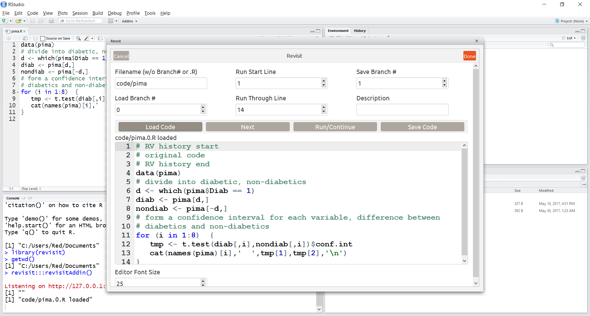
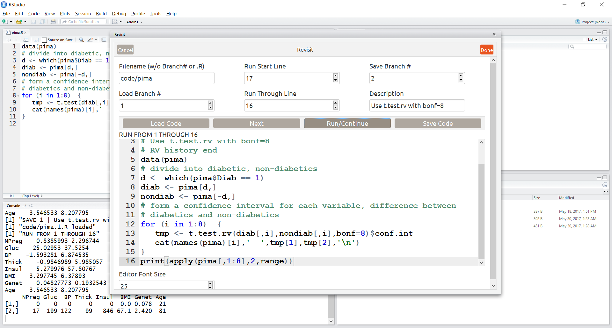
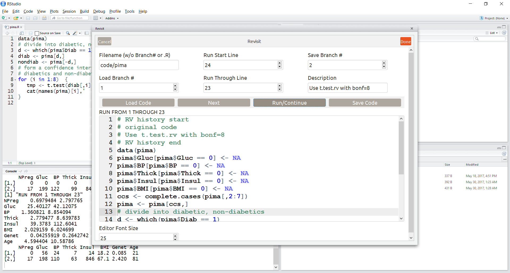

# revisit: an R Package for Statistical Reproducibility and Alternate Analysis

### The reproducibility crisis

In recent years, scientists, especially those who run academic journals
or fund research projects, have been greatly concerned about lack of
*reproducibility* of research.  A study performed by one research group,
with certain findings, is then attempted by another group, with
different findings.  

In addition, there is a related problem, lack of *transparency*. In
reading a paper reporting on certain research, it is often not clear
exactly what procedures the authors used.

[As reported for
instance](http://www.nature.com/news/1-500-scientists-lift-the-lid-on-reproducibility-1.19970)
in the journal *Nature*, the problem is considered by many to have
reached crisis stage.

Much of the concern is statistical in nature. As noted in the above
*Nature* report (emphasis added):

> The survey asked scientists what led to problems in reproducibility.
> More than 60% of respondents said that each of two factors — pressure to
> publish and selective reporting — always or often contributed. More than
> half pointed to insufficient replication in the lab, poor oversight or
> low statistical power.
> 
> Respondents were asked to rate 11 different approaches to improving
> reproducibility in science, and all got ringing endorsements. Nearly 90%
> — more than 1,000 people — ticked "More robust experimental design"
> "better statistics"...

### The **revisit** package 

The package is, made available as open source, is
aimed to help remedy such problems with data/statistics.
In one sense, it might be termed a *statistical audit*, allowing users
to check the statistical analyses of the original authors of a study,
but it really is much more.  In our referring to "users" below, keep in
mind that this could mean various kinds of people, such as:

* The various authors of the study, during the period when the study is
  being conducted.  The package will facilitate collaboration among the
  authors at that time.

* Reviewers of a manuscript on the study, presented for possible
  publication.  The package will facilitate the reviewers' checking of
  the statistical analyses in the paper, not only verifying the steps
  but, even more importantly, allowing the reviewer to explore
  alternative analyses.

* Other scientists, who are reading a published paper on the study.  The
  package will facilitate these scientists also trying various
  alternative analyses.

The package has two main aspects:

<UL>

<li> It makes it easier and more convenient for the user to explore the
effects of various changes that might be made to the analyses.
The package facilitates replaying, changing and recording various new
versions of the analyses. 
</li> </p> 

<li>  The package spots troublesome statistical situations, and issues
advice and warnings, in light of concerns that too many "false
positives" are being reported in published research.  For example, the
package may:
</p>

   <UL>

      <li>  Point out that a p-value is small and may not to correspond to an
       effect of practical importance." 
      </li> </p> 

       <li> Point out that a "nonsignificant" value corresponds to a
       confidence interval containing both large positive and large
       negative values, so n is too small for a "no significant
       difference finding.
      </li> </p> 
       
      <li> Suggest that the user employ a multiple inference procedure
      (provided in the package).
      </li> </p> 

      <li>  Detect the presence of highly influential outliers, and suggest
        that a robust method, e.g. quantile regression be used.
      </li> </p> 

      <li>  Detect evidence of possible overfitting.
      </li> </p> 

      <li> Etc.
      </li> </p> 

   </UL>

</UL>

More specifically, the user might go through the following thought
processes, and take action using the facilities in the package:

*  The user thinks of questions involving alternate scenarios.  What,
   for instance, would occur if one were to more aggressively weed out
   outliers, or use outlier-resistant methods?  How would the results 
   change?  What if different predictor variables were used, or 
   squared and interaction terms added?  How valid are the models and 
   assumptions?  What about entirely different statistical approaches?

*  In exploring such questions, the user will modify the original
   code, producing at least one new version of the code, and
   likely several versions.  Say for instance the user is considering
   making two changes to the original analysis, one to possibly
   use outlier-resistant methods and another to use multiple-inference
   procedures. That potentially sets up four different versions.
   The **revisit** package facilitates this, making easier for the 
   user to make changes, try them out and record them into different 
   *branches* of the code.  In other words, the package facilitates
   exploration of alternative analyses.

*  In addition, the user may wish to share the results of her exploration 
   of alternate analyses of the data with others.  Since 
   each of her branches is conveniently packaged into a separate file, 
   she then simply sends the files to the other researchers.  The
   package allows the latter to easily "replay" the analyses, and they
   in turn may use the package to produce further branches.

* *Note, though, that the package is not aimed to "automate" statistical
analysis.*  The user decides which analyses to try, with the 
package consisting of tools to help by making it easy to explore, record and
package alternative analyses.

If the original data file is, say, **x.R**, then the branches will be
given names by the users, say **x.1.R**, **x.2.R** and so on.  Each
branch will have a brief, user-supplied description.


### Language and interface

The software is written in R, and is currently *in prototype form*. The
author of the original research is assumed to do all data/statistical
analysis in R.

Both text-based and graphical (GUI) interfaces are available.
The GUI uses RStudio *add-ins*.  The text-based version provides more
flexiblity, while the GUI provides convenience.

### First example

Let's get started, using the GUI.  (See installation instructions
below.)

We start up RStudio (either by icon or by typing 'rstudio' into a
command window), then load the 'revisit' library by typing
'library(revisit)' into the RStudio R console, then (near the top of the
screen) select Addins | Revisit.

In this example, we have copied the package file **examples/pima.R** to
the file **pima.R** in the subdirectory **code** of the R working directory.
We have also copied the package file **data/pima.txt** to the file
**pima.txt** in the subdirectory **data** of the R working directory.
The R working directory can be determined by typing 'getwd()' into the
console.  We then type 'code/pima' into the Filename box, and click Load Code.

This example uses the famous Pima diabetes study at the UCI data repository.
The following table shows the 9 variables in pima.txt, followed by their
descriptions from [this link](https://archive.ics.uci.edu/ml/datasets/pima+indians+diabetes):

| Variable | Description                                                              |
| -------- | ------------------------------------------------------------------------ |
| NPreg    | Number of times pregnant                                                 |
| Gluc     | Plasma glucose concentration a 2 hours in an oral glucose tolerance test |
| BP       | Diastolic blood pressure (mm Hg)                                         |
| Thick    | Triceps skin fold thickness (mm)                                         |
| Insul    | 2-Hour serum insulin (mu U/ml)                                           |
| BMI      | Body mass index (weight in kg/(height in m)^2)                           |
| Genet    | Diabetes pedigree function                                               |
| Age      | Age (years)                                                              |
| Diab     | Class variable (0 or 1)                                                  |

As an illustration, suppose this code was written by the
author of the study.  The dataset is that of the famous Pima diabetes
study at the UCI data repository.

The screen now looks like this:



RStudio is running in the background, and the foreground window shows
the **revisit** add-in running.  The original author's code is shown in
the editor portion in the bottom half of the window.  One can edit the
code, re-run in full or in part, save/load branches and so on.  All output
will be displayed in the R console portion of the background window.

By the way, if Load Branch # is 0 and the branch 0 file cannot be found,
revisit will attempt to load the original author code.  If that file is
found, revisit will automatically create the branch 0 file, identical
to the original author code, but with an identifying comment line.

To replay the author's code, we click Run/Continue .  The new screen is:


The results of the 8 confidence interval computations is shown in the R
console.  (There are 8 variables other than Diab, so the intervals
concern diabetics versus nondiabetics.)

We as the user may now think, "Hmm, one really should use a multiple
inference procedure here."  So we change line 12 to use **revisit** own
function, employing the Bonferroni method with number of comparisons
equal to 8.

We then re-run.  If we fail to reset the Run Start Line and Run Through Line
first, however, we will get the error shown in red in the console below.
This is because **revisit** had already run through the end of the code.
*There is no need to start from the beginning*, so we change the Run Start
Line box to 11, reset the Run Through Line box to the last line (if necessary)
and click Run/Continue, yielding:


Ah, the confidence intervals did indeed get wider, as expected, now in
line with statistical fairness.  (Note that the Run Start Line box has
again moved one past the last line of code.)

Say we believe this branch is worth saving.  The Save Branch # box tells
us the next branch will be named branch 1 (we could change that).  Before
saving, we are required to type in a Description of the change.  If we now
click Save Code, the new branch will be reloaded with the description now
visible in the last line of the revisit history at the top of the file
as shown below:


We should also check whether the author did a good job of data cleaning.
As a crude measure, we can find the range of each of the variables, say
by running the code

``` r
print(apply(pima[,1:8],2,range))
```

We could simply run this code directly if we were in the text-based
version of **revisit**, since there we would have direct control of the
R console, which is not the case in the GUI version. So instead, we add
it temporarily at the end of code editor, as line 15. We change the Run
Start Line box to 16, and hit Run/Continue:



Those 0s are troubling. How can variables such as Glucose and BMI be 0?
The descriptions of the variables above suggest that the 0s for the
variables Gluc, BP, Thick, Insul, and BMI actually represent missing
values.  Those 0s can be set to missing with the following statements:

``` r
pima$Gluc[pima$Gluc == 0] <- NA
pima$BP[pima$BP == 0] <- NA
pima$Thick[pima$Thick == 0] <- NA
pima$Insul[pima$Insul == 0] <- NA
pima$BMI[pima$BMI == 0] <- NA
```

Suppose we add these five statements to the code immediately after
pima is loaded, reset Run Start Line and Run Through Line to run all
of the code, and click Run/Continue.  Following is the result:



### Main functions

**rvinit():**  Initializes the **revisit** system.

**makebranch0(origcodenm):**  Inputs the original author's code and
forms a branch copy of it.

**loadb(br):**  Loads a branch.

**runb(startline,throughline):**  Runs a branch through a user-specified
set of lines in the code, pausing at the end.  By default, these are the
numbers of the first and last lines of the code, but other numbers can
be specified.  Use 'c' to continue from the current line, or 's' to
execute just the current line.  (*Restriction:* The start and finish
lines cannot be inside a loops or if-then-else constructs.)  

**saveb(branchnum,desc):**  Save all the code changes to a new branch
with the given name and brief description.

**pause():**  Insert this call to pause execution at the given
point, useful for instance immediately following a plotting function to
give the user a chance to view the plot.

**t.test.rv(x,y,alpha,bonf):**  Substitute for R's **t.test()**.  Calls the
latter but warns the user if a small p-value arises merely from a large
sample size rather than from a substantial effect.  If **bonf** is
larger than 1, **alpha** will be divided by **bonf** to implement
Bonferroni Inequality-based multiple inference.
Many more of these are planned.

**edt():**  Make a change to the current code.  Calls R's **edit()**,
thus invoking a text editor of the user's choice (or default).
**lcc():**  Display the current code.

### Second example

Here we analyze the data set **ols262**.  (Data and code courtesy of M.
Zavodny, Stata translated to R by R. Davis.)

The data involve a study of the impact of H-1B, [a controversial work
visa
program](http://www.cbsnews.com/news/are-u-s-jobs-vulnerable-to-workers-with-h-1b-visas/).
The author found that for every 100 visa workers, about 262 new jobs are
created.  Our concern here will not be on the economic model used, but
on other issues.  

The data consist of employment figures for each of the 50 states, in
each of the years 2000-2010.

We'll use the text version of **revisit** here.  Assume that we've
copied **examples/ols262.R** to the current directory.

``` r
> library(revisit)
> rvinit()  # required initialization
> loadb('ols262.0.R')  # load the branch
> lcc()  # list the code
1 # RV history start 
2 # original code 
3 # RV history end 
4 # the file public.dta and the Stata code on which this R code is based 
5 # is courtesy of M. Zavodny 
6  
7 data(zav) # zav.txt is .txt version of Zav. file public.dta 
8 zav = zav[zav$year < 2008,] # 2000-2007 (first year in zav.txt is 2000) 
9  
10 ##### traditional employment rate and immigrant share model ##### 
11  
12 # employment rate for natives = employed natives divided by total native 
13 # population 
14 zav$emprate_native   <- zav$emp_native / zav$pop_native * 100 
15  
16 # immigrant stem workers with advanced degrees from U.S. universities,  
17 # share of total workers employed 
18  
19 zav$immshare_emp_stem_e_grad   <- zav$emp_edus_stem_grad / zav$emp_total * 100 
28 zav$lnimmshare_emp_stem_n_grad <- log(zav$immshare_emp_stem_n_grad) 
29  
30 # year in sample (in this case, 2000-2007), converted to factors for 
31 # use as an instrumental variable 
32 zav$fyear  <- as.factor(zav$year) 
33  
34 # 50 states plus Washington D.C., converted to factors for use as an 
35 # instrumental variable 
36 zav$fstate <- as.factor(zav$statefip) 
37  
38 # need to normalize population weights so that each year has same weight; 
39 # otherwise, too much weight assigned to later years 
40 # do for total native population (age 16-64) 
41 zav$sum_pop_native <- with(zav, ave(pop_native, year, FUN=sum)) 
42 zav$weight_native <- zav$pop_native / zav$sum_pop_native 
43  
44 # remove non-positive values so that their logs are valid values (not 
45 # NaN or infinite, plus or minus) 
46 kk <- zav[zav$emp_edus_stem_grad > 0 & zav$emp_nedus_stem_grad > 0,] 
47  
48 # do regression with two independent variables, two instrumental 
49 # variables, and weights to treat years equally 
\50  
51 mm <- (with(kk,  
52    lm(lnemprate_native ~  
53       lnimmshare_emp_stem_e_grad +  
54       lnimmshare_emp_stem_n_grad +  
55       fyear +  
56       fstate,  
57       weights=weight_native))) 
58  
59 # extract slope and p-value from summary 
60 slope <- mm$coefficients[2] 
61 pvalue <- summary(mm)$coefficients[2,4] 
62  
63 # calculate number of native jobs associated with change in immigrant share 
64 ols <- round(slope, 3) 
65 jobs <- sum(zav$emp_native)/sum(zav$emp_edus_stem_grad) * ols * 100 
66 print(paste("Slope   =", slope)) 
67 print(paste("P-value =", pvalue)) 
68 print(paste("Jobs    =", jobs)) 
```

So, let's run the author's original code:

``` r
> runb()
[1] "Slope   = 0.00446438147988468"
[1] "P-value = 0.0140870195483076"
[1] "Jobs    = 262.985782017836"
```

The author removed the years 2008-2010.  We might wonder how things
would change if the full data were used.  So, we call **edt()** (not
shown) to comment out line 8, and re-run:

``` r
> runb()
[1] "Slope   = 0.00180848722715659"
[1] "P-value = 0.33637275201986"
[1] "Jobs    = 124.352299406043"
```

Now, the result is no longer significant, and the point estimate has
been cut in half.
